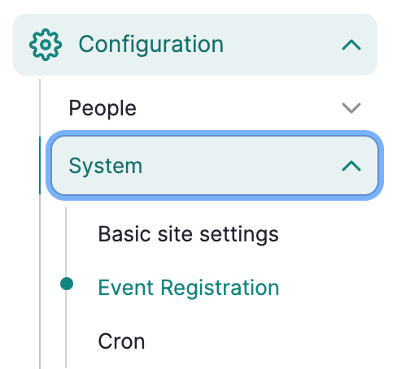
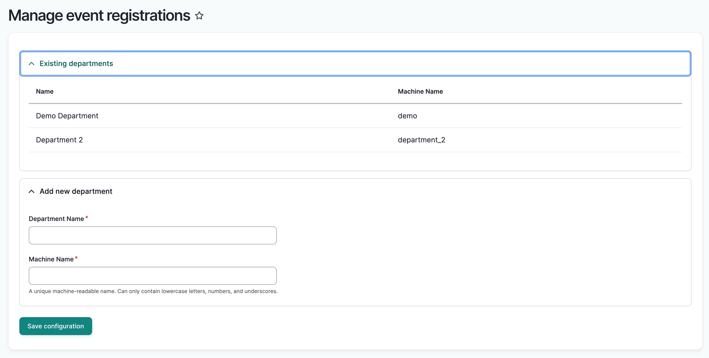
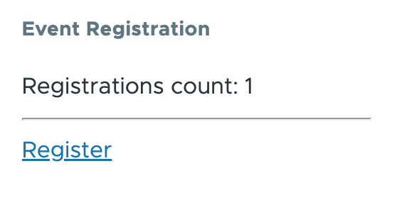
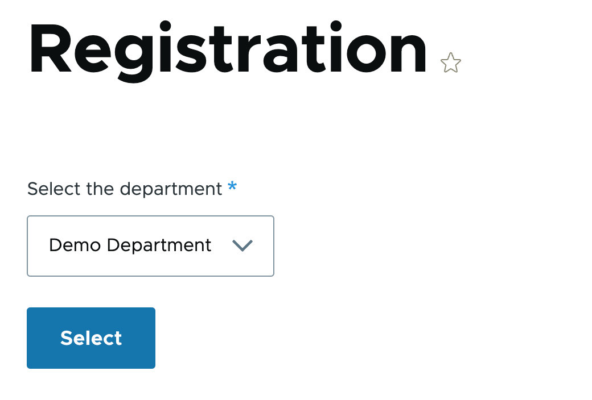
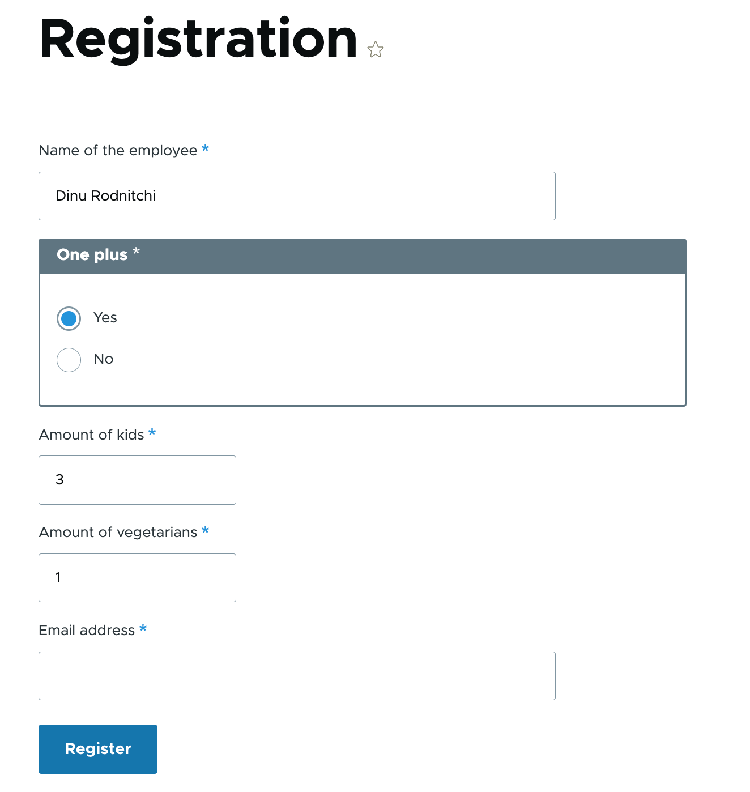

# Event Module - General Info

## Introduction

The goal of this project is to develop a small custom module that collects event registrations for the annual company-wide family event. Every year, `the Company` organizes a family event for all employees and their plus one and kids.

The employees should be able to register for this event in a user friendly way. To prevent letting one person handle all registrations, every department has its own manager responsible for the registrations of his/her department.

The department will have to be captured when submitting the registration form along with the preferences for the event.

## Technical requirements
The project is compatible with Drupal 9/10/11 and runs on PHP 7, 8 / MySQL 5.7+.

# Module components

## Event Registration form
A form with the following data for a single registration:
* Name of the employee (Free text, required)One plus (Yes/No, required)
* Amount of kids (Number, required)
* Amount of vegetarians (Number, required)
* Email address (required)

The form is available at `/registration`.
The form automatically captures the department from the URL. `/registration/finance` will automatically link the registration to the department “Finance” (This means that you can no longer register at /registration, without department)

## Department Configuration form
A form that adds a new department, with the following properties:
* The form is available at `/admin/config/add-department`
* Existing departments are shown in the header of the form
* The form is only be accessible for department managers, admins
* A department has a machine readable name and a human readable name.

### Form validation
* All required fields should be enforced
* Only valid email addresses are allowed
* Amount of vegetarians can not be higher than the total amount of people
* An employee is not be able to register twice (with the same email address)

## Event Registration content type
A small content type “Registration” that holds all the form fields. Create a new node on submit that is filled with the data from the submitted form. Uses the employee name as title.

## Event Registration block
A block that displays the registration count. Te block is cached with `node_list:registration` tag. It invalidates the cache everytime the `registration` nodes are changed.

## Event registration service
A simple service that provides a single method, `registrationsCount()`, which ensures that the registration count can be fetched by other modules.

## Default configuration
* Department manager - role
* Manage event registrations - permission
* Department managers have the granted permission
* Content type for `registration` and content type fields

# Module functionality
## Department Configuration
Department configuration can be accessed via `Configuration -> System -> Event Registration`

  
View instructions

  

    
  

### The configuration form
 The configuration form allows you to submit a new department. The available departments are then loaded into the event submission form.

## Registration info block
The registration info block is displayed on pages where it is enabled. It can be enabled by navigating to `Structure -> Block layout -> Place Block`

## Registration - select department
The first step of the registration process presents a form to select the department. This form can be accessed by clicking `Register` in the registration info block or directly by navigating to `/registration`.

## Registration form
The registration form appears after selecting a department, allowing users to register for the event.

## Registration records
Registration records can be viewed under `Content` or by navigating to `/admin/content`. he content type for these records is `Registration`

# Authors
 * Dinu Rodnitchi (rodnitchi@gmail.com)
